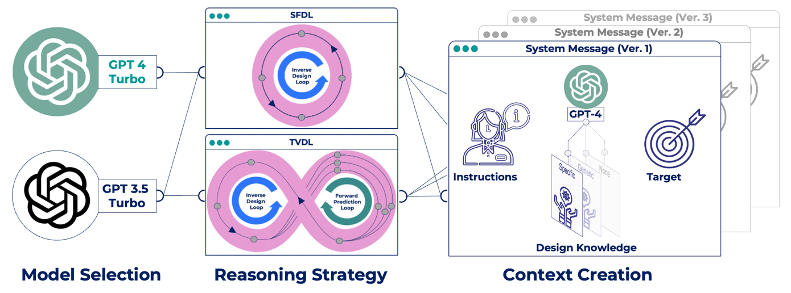

# LLMs can Design Sustainable Concrete – a Systematic Benchmark
## "Code, Data, Results"

**Figure:** Benchmarking the KDD approach in different configurations. Left: Model selection; Center: Implemented reasoning strategies. Right: Variations of system message incl. three different degrees of design knowledge, each in three rephrased versions, respectively.

### Abstract:
In the context of a circular building material economy, the complexity of resource flows and the variability of material composition pose significant challenges. This study demonstrates how Large Language Models (LLMs) can advance material design by adopting a Knowledge-Driven Design (KDD) approach that outperforms traditional Data-Driven Design (DDD) methods. Our focus is on designing alkali-activated concrete (AAC) mix designs, an environmentally friendly alternative to conventional Portland cement-based concrete. GPT-3.5 Turbo and GPT-4 Turbo enable using fuzzy design knowledge as previously untapped input data modality. A key aspect of our research is to improve the performance of the LLMs in post-training. We use strategies such as refining prompt context, extending test time, and including a verifier.The study's systematic benchmarks are based on 240 AAC formulations extracted from the literature. The target was on achieving maximum compressive strength through an adaptive design approach over multiple development cycles. We compare these results to the traditional DDD baseline methods. KDD outperforms conventional methods by providing robust initial predictions and demonstrating effective adaptability informed by laboratory validation data, culminating in the development of high-quality AAC formulations. These results provide valuable insight into the capabilities of chat-based LLMs in managing complex material formulations, which are particularly beneficial in situations where traditional DDD is impractical due to data collection issues.  With natural language as the basis the KDD is intuitively accessible to domain experts.  The methodology and results of this study have significant implications for the field of materials science, particularly in the context of a circular economy, and pave the way for innovative applications of LLMs in various scientific fields.

### Authors:
- Christoph Völker *a
- Tehseen Rug b
- Kevin Maik Jablonka c
- Sabine Kruschwitz a,d

#### Affiliations:
- *a* Bundesanstalt für Materialforschung und -prüfung, Unter den Eichen 87, Berlin, Germany
- *b* Iteratec GmbH, St.-Martin-Str. 114, 81669 Munich, Germany
- *c* Helmholtz Institute for Polymers in Energy Applications, Jena, Germany
- *d* Technische Universität Berlin, Institute of Civil Engineering, Non-destructive building material testing, Gustav-Meyer-Allee 25, 13355 Berlin, Germany

### Installation and Setup:
1. **Prerequisites:**
   - Ensure Python >= 3.8 is installed. [Download Python](https://www.python.org/downloads/)
   - For sequential learning with lolopy, Java >= 8 is required. [Download Java](https://www.java.com/en/download/)

2. **Cloning the Repository:**
   - Clone the repository or download the zip file using the green "Code" button on this project's GitHub main page.

3. **Installing Dependencies:**
   - Navigate to the root directory of the project.
   - **Using pip:**
     - Create a new virtual environment: `python3 -m venv <name_of_virtualenv>`
     - Activate the virtual environment: 
       - Windows: `.<name_of_virtualenv>\Scripts\activate`
       - Unix/Mac: `source <name_of_virtualenv>/bin/activate`
     - Install dependencies: `pip3 install -r requirements.txt`
   - **Using conda:**
     - **On Linux:**
       - Install Miniconda and run `conda env create -f environment.yml`
       - Activate the new environment: `conda activate WEBSLAMD`
     - **On Windows:**
       - Install Anaconda or Miniconda.
       - Open "Anaconda Prompt", navigate to your project folder and run `conda env create -f environment.yml`
       - Activate the new environment: `conda activate WEBSLAMD` or through Anaconda Navigator.

### Usage Instructions:
1. **Running Experiments:**
   - Open `Benchmarking.ipynb` and configure experiments using IPython widgets. Run each cell in sequence.
2. **Visualizing Results:**
   - Use `PlotResults` to select and visualize results.

### Note on OpenAI API Usage:
- Running the benchmarking requires an OpenAI API key, which may incur costs. Ensure you have obtained the key and are aware of potential expenses.

### License:
This project is licensed under the [MIT License](LICENSE).

### Citation:
For citing this work in academic papers, please refer to the citation format provided in `CITATION.md` (added upon publication).

### Contact:
For further inquiries or collaboration, please contact christoph.voelker@bam.de.

